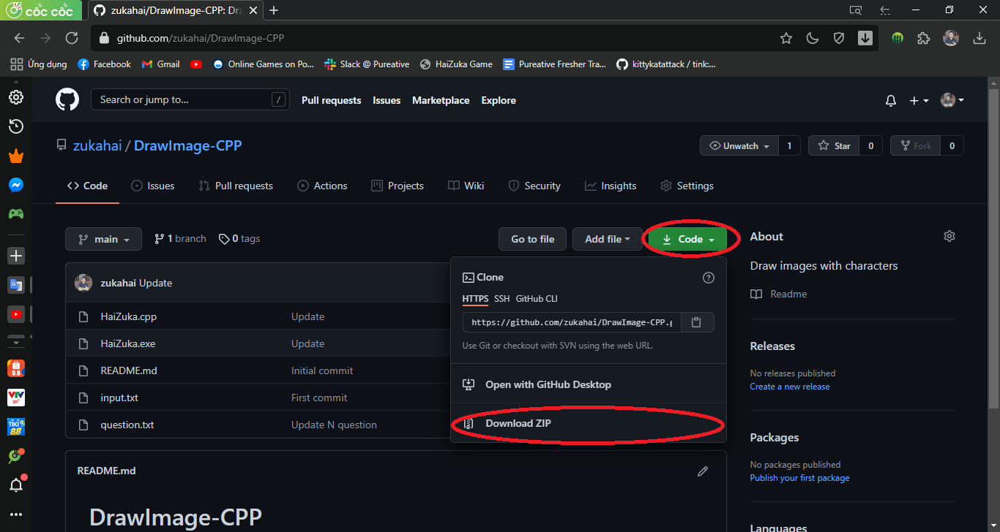
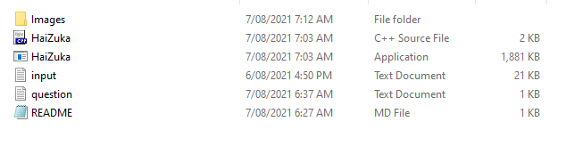
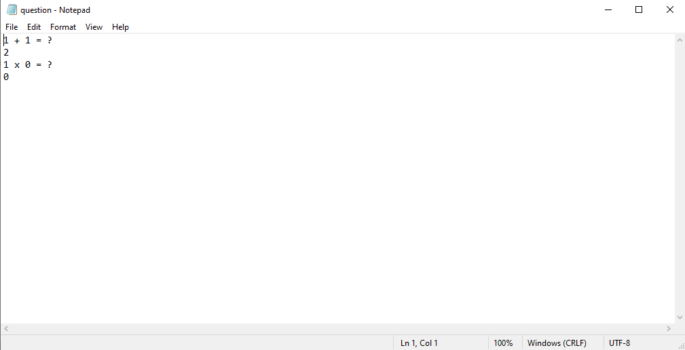

## <p align="center"> Draw Image </p>

### Bước 1: Tải code
<p align="center">  </p>
Tại giao diện này hãy bấm vào code -> download zip.
Xong các bạn giải nén ra nhé. Sau khi giải nén các bạn sẽ có các tập tin sau:
<p align="center">  </p>

## Bước 2: Tạo các câu hỏi
Để tăng phần thú vị cho chương trình thì khi chạy chương trình người dùng sẽ phải trả lời một số câu hỏi của bạn thì chương trình mới hoạt đông.
Các bạn chỉnh sửa file question.txt để sửa phần này.
Ở trong file này các bạn sẽ lần lượt điền các câu hỏi và câu trả lời (câu hỏi trên 1 dòng, câu trả lời trên một dòng).
Định dang file question.txt sẽ như sau

```
  Câu hỏi 1
  Đáp án 1
  Câu hỏi 2
  Đáp án 2
  ...
  Câu hỏi N
  Đáp án N
```
Ví dụ file question.txt
<p align="center">  </p>
