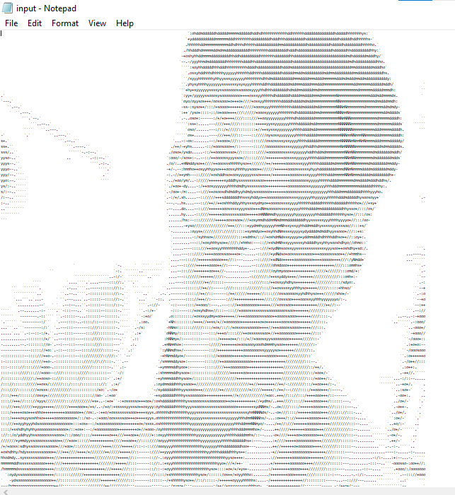
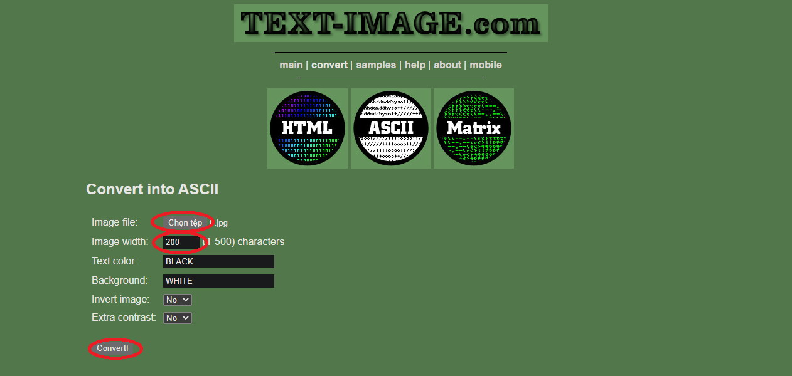
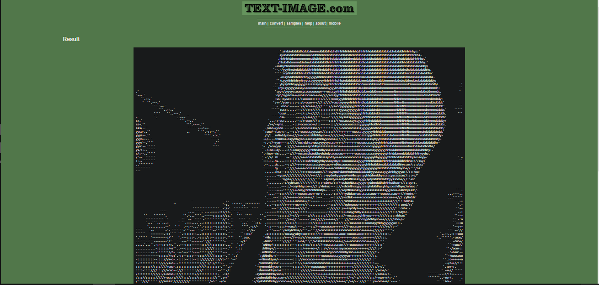
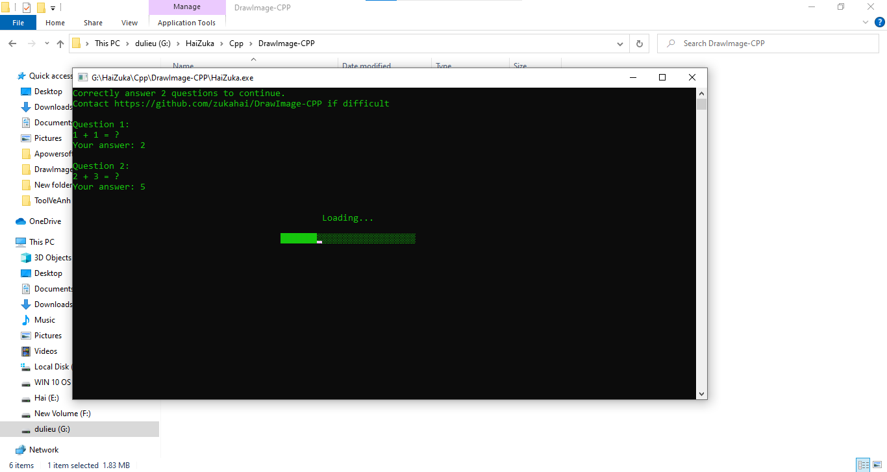
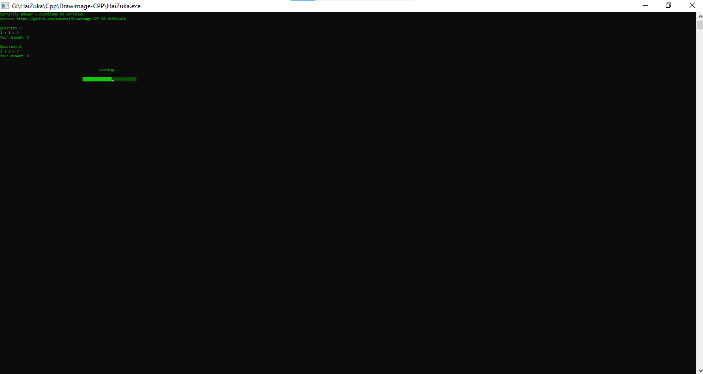
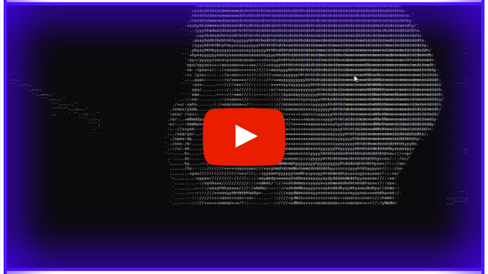

## <p align="center"> Draw Image </p>


Lưu ý: Nên chạy code trên máy tính.

### Bước 1: Tải code
<p align="center">  </p>
Tại giao diện này hãy bấm vào code -> download zip.
Xong các bạn giải nén ra nhé. Sau khi giải nén các bạn sẽ có các tập tin sau:

<p align="center">  </p>

## Bước 2: Tạo các câu hỏi
Để tăng phần thú vị cho chương trình thì khi chạy chương trình người dùng sẽ phải trả lời một số câu hỏi của bạn thì chương trình mới hoạt đông.
Các bạn chỉnh sửa file question.txt để sửa phần này.
Ở trong file này các bạn sẽ lần lượt điền các câu hỏi và câu trả lời (câu hỏi trên 1 dòng, câu trả lời trên một dòng).
Định dang file question.txt sẽ như sau

```
  Câu hỏi 1
  Đáp án 1
  Câu hỏi 2
  Đáp án 2
  ...
  Câu hỏi N
  Đáp án N
```
Ví dụ file question.txt

<p align="center">  </p>

### Bước 3: Tạo file ký tự cho bước ảnh của bạn.
Bạn cần có một file ký tự tương tụ như thế này.

<p align="center">  </p>
Đừng thấy khó mà bỏ qua nhé, sẽ có website giúp bạn làm việc này, các bạn truy cập và trang web:

https://www.text-image.com/convert/ascii.html

<p align="center">  </p>
Các bạn bấm vào chọn tệp để chọn hình ảnh mà bạn muốn chuyển đổi.
Phần image width các bạn để cho mình là 200 nhé.
Bấm vào phần convert để chuyển đổi, các bạn sẽ được kết quả tương tự như thế này.
<p align="center">  </p>
Các bạn copy hết lại và cho vào file input.txt nhé, nhớ lưu lại đó nha.

### Bước 4: Chạy chương trình.
Các bạn chơi file HaiZuka.exe để chạy chương trình nhé.
Bắt đầu chương trình người dùng phải trả lời chính các câu hỏi mà bạn đã đặt ra:

<p align="center">  </p>

<p align="center">  </p>
Trong lúc chương trình đang loading, các bạn nhanh chóng thu nhỏ màn hình lại bằng cách đồng thời giữ phím ctrl và lăn chuổi nhé, khi đã thu nhỏ được màn hình (cái này do các bạn tự biết nhỏ thế nào là hợp lý nhé) cuối cùng các bạn ấn full màn hình và tận hượng thành quả nhé.

<p align="center">  </p>

## <p align="center"> Chúc các bạn thành công </p>

### Xem Video hướng dẫn sử dụng.
[<p align="center">  </p>](https://www.youtube.com/watch?v=BYcQ64fNCPA)
